# 컬러링북 생성 시스템

Python OpenCV 기반 컬러링북 생성 프로젝트입니다. 사용자가 이미지를 입력하면 색상을 단순화하고, 닫힌 경계선을 만든 뒤, 색칠 가능한 영역마다 팔레트 번호를 배치한 paint-by-number 스타일 이미지를 생성합니다.

현재 핵심 배치 파이프라인은 `server/scripts/batch_difficulty_pipeline.py`입니다. 이 스크립트는 입력 폴더의 이미지를 한 번씩 분석하고, `easy`, `normal`, `hard` 세 난이도 결과와 검수용 segmentation preview, CSV 요약 파일을 생성합니다.

## 구성

- `server/scripts/batch_difficulty_pipeline.py`: 난이도별 배치 컬러링북 생성 파이프라인
- `server/src/coloringbook_utils.py`: K-Means, 경계선 처리, 영역 분리, 번호 배치 등 공통 함수
- `server/data/`: 기본 입력 이미지 폴더
- `server/outputs/`: 기본 결과 이미지 및 요약 CSV 저장 폴더
- `server/01_color_quantization.ipynb`: K-Means, Posterization, Median Cut 색상 단순화 비교
- `server/02_edge_detection.ipynb`: Sobel, Laplacian, Canny 경계선 추출 비교
- `server/03_segmentation.ipynb`: Connected Components, Contour, Watershed 영역 분리 및 번호화
- `server/04_final_pipeline.ipynb`: 최종 파이프라인, 성능 분석, HCI 평가 정리
- `web/`: 프론트엔드 프로젝트

## 배치 난이도 파이프라인

### 실행

```bash
cd server
pip install -r requirements.txt
python scripts/batch_difficulty_pipeline.py --data-dir data --output-dir outputs
```

옵션:

- `--data-dir`: 입력 이미지 폴더입니다. 기본값은 `server/data`입니다.
- `--output-dir`: 결과 저장 폴더입니다. 기본값은 `server/outputs`입니다.
- `--max-size`: 작업 해상도의 긴 변 상한을 지정합니다. 자동 정책은 유지하되 큰 이미지를 제한할 때 사용합니다.
- `--no-auto-policy`: 이미지 분석 기반 자동 정책 선택을 끄고, 원본 크기 또는 `--max-size`만 적용합니다.

지원 확장자는 `.jpg`, `.jpeg`, `.png`, `.bmp`, `.webp`, `.tif`, `.tiff`입니다.

### 출력물

각 입력 이미지마다 난이도별로 다음 파일이 생성됩니다.

- `{이미지명}_easy_k{K}.png`: 쉬운 난이도 컬러링북 결과
- `{이미지명}_normal_k{K}.png`: 보통 난이도 컬러링북 결과
- `{이미지명}_hard_k{K}.png`: 어려운 난이도 컬러링북 결과
- `{이미지명}_{난이도}_k{K}_segmentation_filled.png`: 실제 분할 영역이 잘 닫혔는지 확인하는 색상 채움 preview
- `batch_difficulty_summary.csv`: 이미지명, 난이도, K, 영역 수, 작은 영역 수, edge density, 원본/작업 크기, 적용 정책, 출력 파일명 요약

## Landscape 단계별 산출물 예시

예시는 `server/data/landscape.jpg`를 사용했습니다. README용 이미지는 빠른 확인을 위해 작업 긴 변을 `900px`로 제한해 생성했습니다.

- 원본 크기: `5184x3456`
- 문서용 작업 크기: `900x600`
- 자동 정책: `normal`
- 프로파일: `edge_density=0.0256`, `blur_variance=133.7`, `lab_spread=86.6`
- 추정 `min_k`: `13`
- 난이도별 K: `easy=13`, `normal=23`, `hard=33`

### 단계별 중간 결과

| 단계 | 산출물 | 예시 |
| --- | --- | --- |
| 1-3. 프로파일링, 정책 선택, 작업 해상도 조정 | 작업 해상도로 로드된 landscape 입력 |  |
| 4. K-Means 전 단순화 | mean shift + bilateral filter 적용 결과 |  |
| 5-6. 최소 K 추정 및 normal K 적용 | `normal` 난이도 `K=23` K-Means 양자화 결과 |  |
| 7-8. 배경 병합 및 작은 라벨 섬 정리 | 라벨 정리 후 팔레트 이미지 |  |
| 9. 주요 색상 경계선 생성 | K-Means 라벨 기반 object edge | 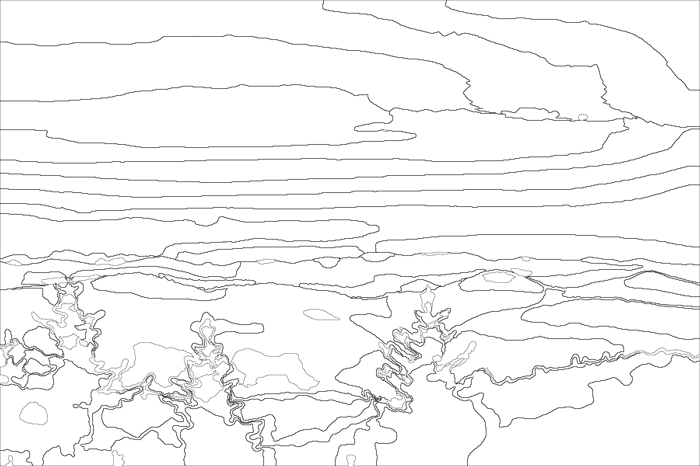 |
| 10. 원본 디테일 경계 승격 | 원본 이미지에서 보강한 세부 경계 |  |
| 11-a. 어두운 디테일 보존 | 작은 어두운 영역 경계 |  |
| 11-b. 닫힌 세부 형태 보존 | 닫힌 윤곽 후보 보강 결과 | 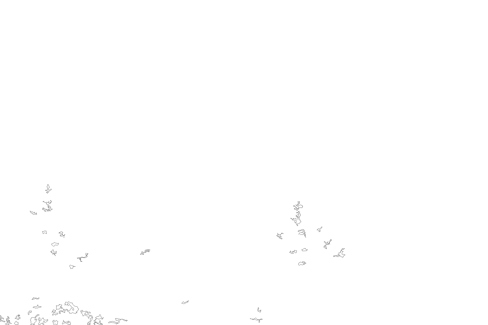 |
| 12. 경계선 연결 | 닫힌 색칠 영역을 만들기 위한 최종 segmentation line | 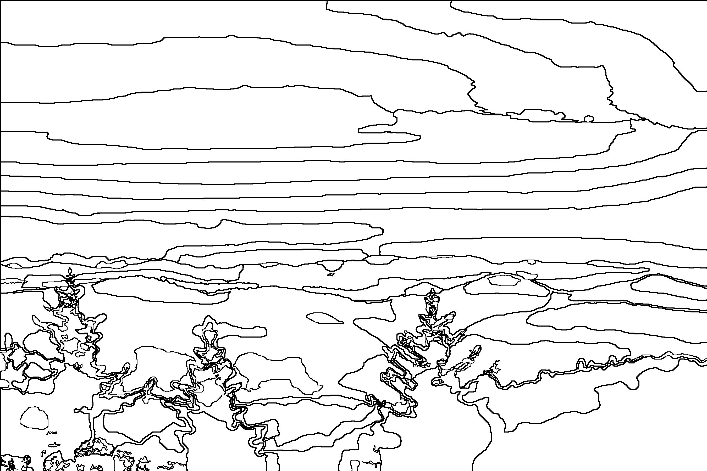 |
| 13. 영역 분리 | connected components 영역 preview | 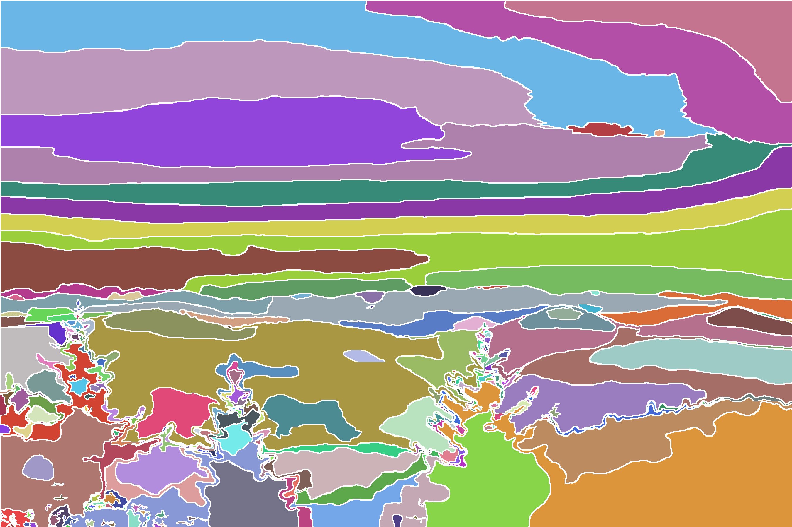 |
| 14. 최종 렌더링 | `normal`, `K=23` 번호 포함 컬러링북 | 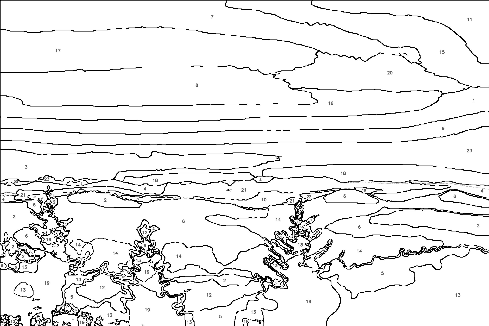 |
| 15. 검수용 preview | `normal`, `K=23` segmentation filled preview | 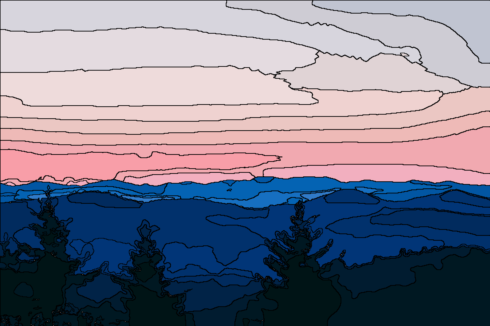 |

### 난이도별 최종 결과

| 난이도 | K | 컬러링북 결과 | 채움 preview |
| --- | ---: | --- | --- |
| easy | 13 | 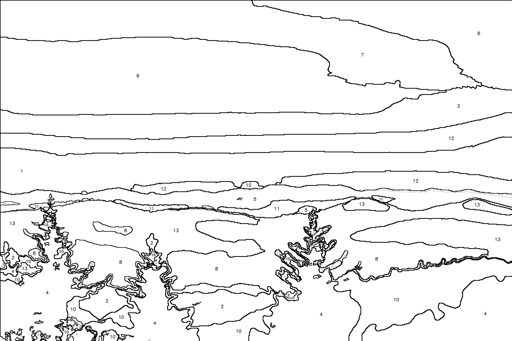 | 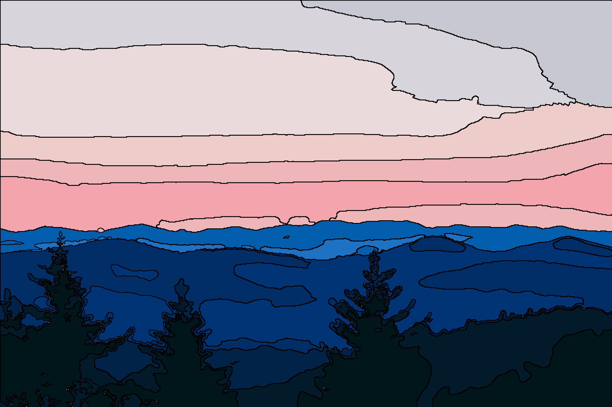 |
| normal | 23 | 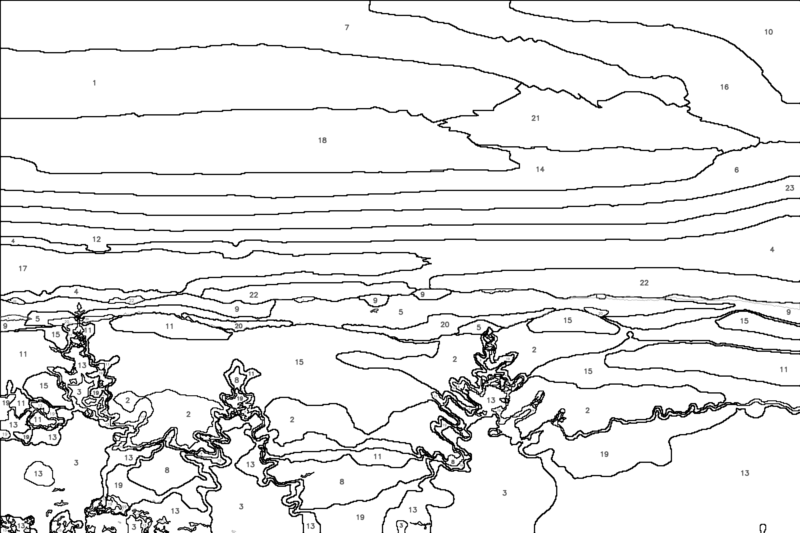 | 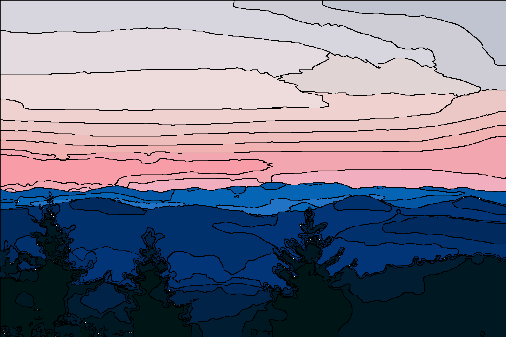 |
| hard | 33 | 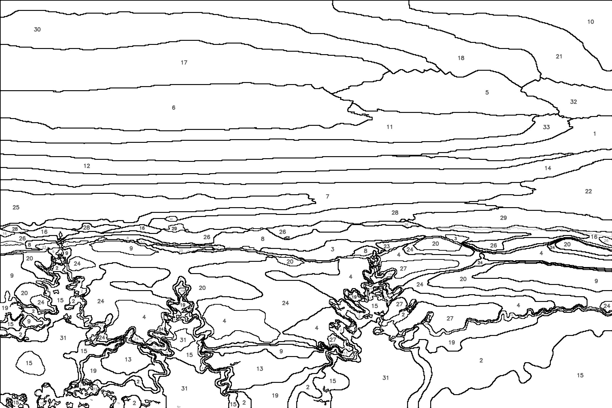 | 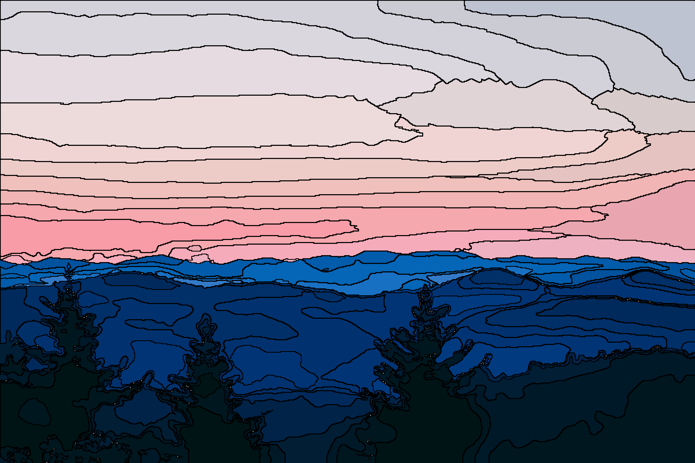 |

## 단계별 처리 흐름

### 1. 입력 이미지 프로파일링

`analyze_image_profile()`은 큰 이미지도 빠르게 판단할 수 있도록 긴 변 최대 900px 샘플에서 복잡도를 측정합니다.

- 원본 너비/높이와 긴 변 길이
- Canny 기반 `edge_density`
- Laplacian 기반 blur variance
- Lab 색공간의 색상 분산 정도
- coarse Lab 색상 수

이 값들은 이미지가 세밀한 사진인지, 단순한 flat-color 그림인지, 흐릿한 이미지인지 판단하는 기준이 됩니다.

### 2. 자동 처리 정책 선택

`choose_processing_policy()`는 프로파일링 결과를 실제 처리 파라미터로 바꿉니다.

- 작은 원본은 최소 작업 긴 변 `1100px`까지 키워 번호와 경계선을 확보합니다.
- 디테일이 많은 이미지는 최대 `2400px`까지 보존합니다.
- 디테일이 낮거나 흐릿한 이미지는 기본 `1800px` 수준으로 제한합니다.
- 단순 flat-color 그림은 과분할을 막기 위해 `k_upper_bound`를 `18`로 낮추고 난이도별 K 증가 폭을 줄입니다.
- 정책 이름은 `high`, `normal`, `simple`, `soft`, 또는 자동 정책을 끈 경우 `fixed`로 기록됩니다.

### 3. 로드 및 작업 해상도 조정

`load_image_preserve_size()`는 이미지를 RGB로 로드하고, 선택된 정책에 따라 작업 해상도로 리사이즈합니다. `--max-size`가 있으면 긴 변 상한으로 적용되지만, 작은 원본은 자동 정책에서 최소 작업 크기를 유지합니다.

### 4. K-Means 전 색상/질감 단순화

`smooth_before_kmeans()`는 K-Means가 JPEG 노이즈나 작은 텍스처에 끌려가지 않도록 mean shift filtering과 bilateral filter를 적용합니다. 목표는 의미 있는 색 면을 유지하면서 불필요한 미세 색 변화만 줄이는 것입니다.

### 5. 이미지별 최소 K 추정

`estimate_min_k_from_smoothed_colors()`는 coarse RGB 색상 수와 Lab spread를 사용해 이미지가 알아볼 수 있을 만큼 필요한 최소 팔레트 크기 `min_k`를 추정합니다. 결과는 `3`에서 `40` 사이로 제한됩니다.

### 6. 난이도별 K 결정

`difficulty_k_values()`는 `min_k`에 난이도별 margin을 더해 최종 K를 만듭니다.

- 기본 정책: `easy = min_k`, `normal = min_k + 10`, `hard = min_k + 20`
- 단순 flat-color 정책: `easy = min_k`, `normal = min_k + 4`, `hard = min_k + 8`

최종 K는 정책의 `k_upper_bound`를 넘지 않습니다.

### 7. 단순 그림 배경 라벨 병합

`merge_background_similar_labels()`는 flat-color 이미지에서 배경과 거의 같은 K-Means 라벨을 하나로 합칩니다. 배경색은 이미지 테두리에서 추정하며, 배경 근처의 미세한 색 차이가 색칠 영역으로 분리되는 것을 줄입니다.

### 8. 작은 라벨 섬 제거

`absorb_tiny_label_islands()`는 K-Means 라벨 맵에서 작은 고립 영역을 주변 라벨로 흡수합니다. 아주 작은 색상 노이즈가 독립된 색칠 영역이나 불필요한 경계선으로 변하는 것을 막습니다.

### 9. 주요 색상 경계선 생성

`object_first_edges()`는 K-Means 라벨이 바뀌는 큰 색상 면의 외곽선을 추출합니다. 이 선은 사용자가 색칠할 수 있는 영역을 나누는 기본 검은 경계선입니다.

### 10. 원본 디테일 경계 승격

`source_detail_boundary_edges()`는 K-Means만으로 놓치기 쉬운 원본 이미지의 중요한 경계를 추가합니다. 예를 들어 얼굴 표정, 작은 물체의 경계, 밝기 차이는 작지만 색 차이가 큰 부분을 보완합니다.

### 11. 어두운 디테일 및 닫힌 세부 형태 보존

`dark_detail_region_edges()`는 눈동자처럼 작고 어두운 영역을 잡고, `closed_detail_shape_edges()`는 거의 닫혀 있는 작은 윤곽을 연결해 색칠 가능한 형태로 보존합니다. 이 단계는 캐릭터나 인물 이미지에서 표정이 사라지는 문제를 줄입니다.

### 12. 경계선 연결 및 영역 분리

여러 경계 후보를 합친 뒤 `connect_segmentation_edges()`와 `clean_edges()`로 끊긴 선을 연결하고 노이즈를 정리합니다. 이후 선 이미지를 반전해 `segment_connected_components()`로 실제 색칠 가능한 흰 영역을 라벨링합니다.

### 13. 색상 번호 배정

`assign_region_color_numbers()`는 각 connected component 안에서 가장 많이 차지하는 K-Means 팔레트 라벨을 찾아 번호를 배정합니다. 서로 떨어진 영역이라도 같은 대표 색상이면 같은 번호가 들어갑니다. 테두리와 연결된 큰 배경 영역은 배경으로 표시해 최종 번호 대상에서 제외합니다.

### 14. 최종 컬러링북 렌더링

`draw_paint_by_number_style()`은 흰 배경 위에 검은 segmentation line, 회색 detail line, 팔레트 번호를 그립니다.

- 검은 선: 색칠 영역을 나누는 닫힌 경계
- 회색 선: 질감이나 표정 표현용 보조 선
- 번호: 영역 내부에서 경계와 가장 멀리 떨어진 지점을 우선 사용하며, 번호끼리 겹치면 생략합니다.

### 15. 검수용 채움 preview 생성

`draw_segmentation_filled_preview()`는 분리된 영역을 대표 팔레트 색으로 채운 이미지를 만듭니다. 최종 출력 전에 영역 누수, 끊긴 경계, 너무 작은 영역이 있는지 확인하기 위한 검수용 결과입니다.

### 16. 배치 오케스트레이션 및 CSV 요약

`run_batch()`는 입력 폴더의 모든 이미지를 순회합니다. 이미지는 한 번만 프로파일링하고, 같은 정책과 작업 해상도를 공유한 상태에서 `easy`, `normal`, `hard`를 각각 렌더링합니다. 처리 로그에는 원본 크기, 작업 크기, edge density, blur, Lab spread, 정책, `minK`, 난이도별 K가 출력됩니다.

## 발표용 알고리즘 요약

### 색상 단순화

- `K-Means`: 원본 이미지의 픽셀 색상을 K개의 대표 색상으로 군집화합니다. 색상 보존력이 좋아 최종 기본 알고리즘으로 사용합니다.
- `Posterization`: RGB 값을 일정 구간으로 나눠 빠르게 색상을 줄입니다. 속도는 빠르지만 색상 경계가 다소 부자연스러울 수 있습니다.
- `Median Cut`: 색상 분포가 넓은 축을 반복적으로 나눠 팔레트를 만듭니다. 알고리즘 설명용 비교 대상으로 적합합니다.
- `최소 표현 K 추정`: 고정 K를 쓰지 않고 이미지별 색 다양성을 바탕으로 최소 팔레트 크기를 추정합니다.

### 경계선 추출

- `Canny`: 밝기 변화 기반의 안정적인 기본 경계선을 만듭니다.
- `Color Boundary`: 밝기 차이가 작아 Canny가 놓치는 색상 경계를 보완합니다.
- `Morphology`: Closing으로 끊긴 선을 연결하고, 작은 노이즈를 정리합니다.
- `Detail Promotion`: K-Means 경계만으로 사라지는 표정, 눈, 작은 물체 경계를 원본에서 다시 승격합니다.

### 영역 분리 및 번호화

- `Connected Components`: 검은 선으로 나뉜 흰 영역을 색칠 가능한 영역으로 라벨링합니다.
- `Color Numbering`: 영역 고유 ID가 아니라 대표 팔레트 색상 번호를 출력합니다.
- `Background Merge`: 배경과 가까운 색은 배경으로 병합해 불필요한 번호를 줄입니다.
- `Label Placement`: 영역 내부에서 가장 넓게 비어 있는 위치를 찾아 번호를 배치합니다.

## HCI 평가 관점

- 색칠 난이도: K와 영역 수가 증가할수록 복잡도가 높아지는지 확인합니다.
- 경계선 가독성: 검은 선이 닫혀 있고 색칠 영역을 명확히 나누는지 확인합니다.
- 번호 인식 편의성: 번호가 영역 안에 들어가며 서로 겹치지 않는지 확인합니다.
- 디테일 보존: 인물의 눈, 표정, 작은 물체가 난이도와 관계없이 알아볼 수 있게 남는지 확인합니다.
- 검수 가능성: segmentation filled preview로 누수와 과분할을 빠르게 확인할 수 있습니다.
